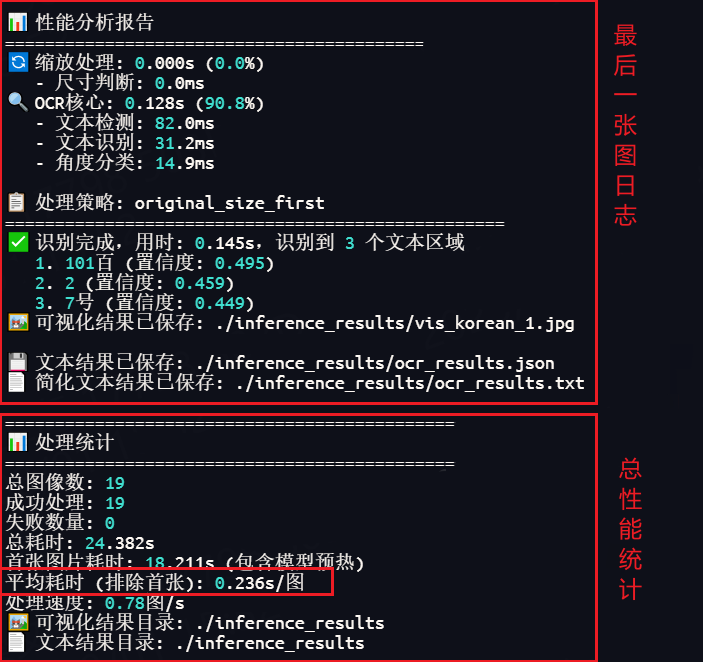
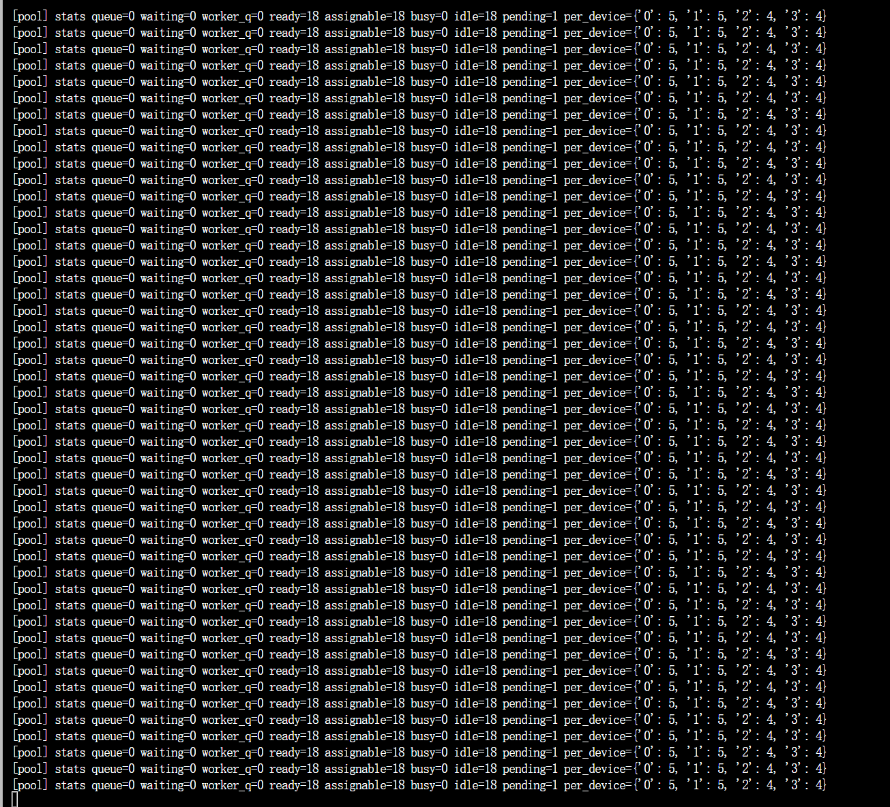
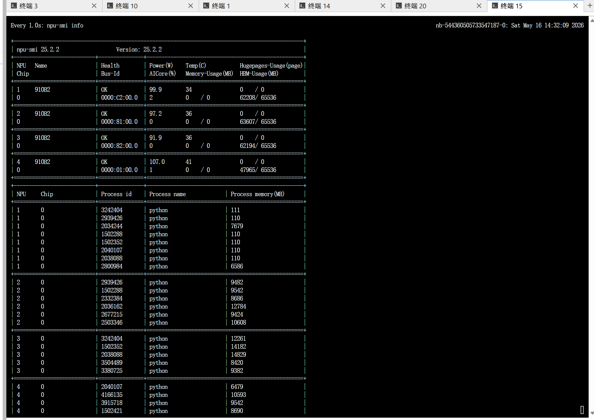

# PaddleOCR-NPU

[](https://www.hiascend.com/) [](https://github.com/PaddlePaddle/PaddleOCR) [](LICENSE)

## 🚀 项目简介

>本项目是基于原版 [PaddleOCR2Pytorch](https://github.com/frotms/PaddleOCR2Pytorch) 的**昇腾(Ascend)NPU**增强版本

**PaddleOCR-NPU** 是专为华为 **昇腾(Ascend)NPU** 优化的高性能OCR文字识别引擎，基于 [PaddleOCR2Pytorch](https://github.com/frotms/PaddleOCR2Pytorch) 深度优化。本项目提供企业级OCR解决方案，适用于文档识别、票据识别、证件识别、表格识别，以及视频隐私脱敏链路中的文本检测与识别等生产环境应用，实现`PaddleOCR`模型在`NPU`下的高性能部署。

**⭐ 如果这个项目对你有帮助，请给个Star支持一下~**


### 🎯 核心优势

- **🚀 昇腾NPU原生支持** - 完整适配华为昇腾NPU，充分发挥硬件性能
- **⚡ 极速OCR推理** - 单页文字识别 0.3~0.5 秒，同时满足高并发需求
- **🔁 多卡动态扩缩容** - 基于 `MultiProcessOCRPool` 在多张 NPU 卡上按压力自动扩容、空闲自动缩容
- **🏭 企业级部署** - 已验证稳定性，支持7x24小时连续运行
- **📈 性能卓越** - 相比`PaddleOCR`在`NPU`上提升300%+推理速度

### 🔥 新增功能
- **🎯 华为昇腾NPU适配** - 完整支持昇腾NPU硬件加速，显著提升推理性能
- **🌐 企业级API服务** - FastAPI框架，RESTful接口，支持生产环境部署
- **🧠 多卡多实例调度** - 支持单机多卡、多实例并发推理，按 HBM 和队列压力动态伸缩
- **🛡️ 隐私脱敏底座** - 可作为视频隐私模糊/马赛克链路中的文字检测与识别基础能力
- **📸 智能图像预处理** - 自动图片压缩优化，内存使用优化
- **⚡ 批量OCR优化** - 模型级批处理优化，多图处理速度提升40%，单图提升30%
- **📊 性能监控分析** - 内置 pool stats、`/info` 状态接口和 OCR 识别监控能力
- **🛠️ 开发者工具** - 提供命令行工具和快速启动脚本

## 🚀 快速开始

### 环境要求
```bash
Python 3.10
PyTorch 2.1.0
```

### 安装依赖
```bash
pip install -r requirements.txt

# 下载PyTorch安装包
wget https://download.pytorch.org/whl/cpu/torch-2.1.0-cp310-cp310-manylinux_2_17_aarch64.manylinux2014_aarch64.whl
# 下载torch_npu插件包
wget https://gitee.com/ascend/pytorch/releases/download/v6.0.0-pytorch2.1.0/torch_npu-2.1.0.post10-cp310-cp310-manylinux_2_17_aarch64.manylinux2014_aarch64.whl
# 安装命令
pip3 install torch-2.1.0-cp310-cp310-manylinux_2_17_aarch64.manylinux2014_aarch64.whl
pip3 install torch_npu-2.1.0.post10-cp310-cp310-manylinux_2_17_aarch64.manylinux2014_aarch64.whl
```


### 模型下载
> 由`PaddleOCR2Pytorch`作者维护：
> PyTorch模型下载链接：https://pan.baidu.com/s/1r1DELT8BlgxeOP2RqREJEg 提取码：6clx

以下推理样例使用模型：`ptocr_v5_server_det.pth`、`ptocr_v5_server_rec.pth`、`ch_ptocr_mobile_v2.0_cls_infer.pth`。

请下载并将其放入`models`文件夹下。

### 快速验证脚本

```bash
# 单图识别 (默认NPU加速)
python quick_ocr.py --image_dir doc/imgs/

# 或指定模型路径
python quick_ocr.py --image_dir doc/imgs/ \
  --det_model_path ./ptocr_v5_server_det.pth \
  --rec_model_path ./ptocr_v5_server_rec.pth \
  --cls_model_path ./ch_ptocr_mobile_v2.0_cls_infer.pth
```

其他方式：[模型预测](./doc/inference.md)

### 效果展示

**处理日志示例**



**可视化结果示例**


### 启动服务

```bash
# 基础启动（默认端口 6663，所有参数使用默认值）
python start_server.py

# 自定义端口和地址
python start_server.py --port 6664

# 禁用方向分类模型（提升速度，减少显存）
python start_server.py --disable_angle_cls

# 多卡多实例动态扩缩容
python start_server.py \
  --npu_device_ids 0,1,2,3 \
  --min_instances 4 \
  --max_instances 24 \
  --per_card_max 6 \
  --idle_timeout 600

# 小字、水印、长文本召回优先
python start_server.py \
  --det_limit_side_len 2560 \
  --drop_score 0.0 \
  --max_text_length 64
```

### 运维脚本启动

如果你希望像服务一样后台启动、重启、查看状态和追日志，推荐直接使用仓库内置脚本：

```bash
# 启动服务（默认端口 6663）
bash scripts/ocr_service.sh start

# 重启服务
bash scripts/ocr_service.sh restart

# 查看服务状态
bash scripts/ocr_service.sh status

# 实时查看日志
bash scripts/ocr_service.sh logs

# 停止服务
bash scripts/ocr_service.sh stop

# 强制清理残留进程
bash scripts/ocr_service.sh purge
```

脚本特点：

- 使用 `setsid + nohup + disown` 后台启动，退出终端后服务不会被带掉
- 自动写入 `logs/ocr_service.log` 和 `logs/ocr_service.pid`
- `restart` 会先尝试按 PID 和进程组优雅停止，再按端口与 cmdline 清理残留进程
- 当 `ss`、`lsof`、`fuser` 无法解析监听 PID 时，会回退到 `pkill -f "python.*start_server.py"` 做兜底清理

常见自定义启动方式：

```bash
# 将服务改到其他端口
PORT=6664 bash scripts/ocr_service.sh start

# 指定多卡与实例池参数
PORT=6663 \
PHYSICAL_NPU_DEVICE_IDS=0,1,2,3 \
SERVICE_LOCAL_NPU_DEVICE_IDS=0,1,2,3 \
MIN_INSTANCES=4 \
MAX_INSTANCES=24 \
PER_CARD_MAX=6 \
IDLE_TIMEOUT=600 \
bash scripts/ocr_service.sh restart
```


## 🌐 API接口

### 服务信息
- **默认地址**: `http://localhost:6663`
- **API文档**: `http://localhost:6663/docs`
- **支持格式**: JPG, JPEG, PNG
- **健康检查**: `GET /health`
- **服务状态**: `GET /info`
- **单图识别**: `POST /ocr/single`
- **批量识别**: `POST /ocr/batch`
- **文件上传识别**: `POST /ocr/upload`

### **请求示例**

**常用 curl 检查命令**:

```bash
# 轻量健康检查：只看 OCR pool 是否 ready
curl http://127.0.0.1:6663/health

# 深度健康检查：额外触发一次真实 OCR 推理（带 30 秒缓存）
curl "http://127.0.0.1:6663/health?probe=1"

# 查看服务信息和当前实例池状态
curl http://127.0.0.1:6663/info

# 查看服务统计信息
curl http://127.0.0.1:6663/stats
```

**curl示例**:

```bash
curl --request POST \
  --url http://localhost:6663/ocr/upload \
  --header 'Accept: */*' \
  --header 'Accept-Encoding: gzip, deflate, br' \
  --header 'Connection: keep-alive' \
  --header 'User-Agent: PostmanRuntime-ApipostRuntime/1.1.0' \
  --header 'content-type: multipart/form-data' \
  --form 'file=@/path/to/your/document.jpg'
```

更简洁的上传测试命令：

```bash
curl -F "file=@doc/imgs/00006737.jpg" http://127.0.0.1:6663/ocr/upload
```

**Python示例**:
```python
import requests
import base64

with open("image.jpg", "rb") as f:
    image_data = base64.b64encode(f.read()).decode()

response = requests.post("http://localhost:6663/ocr/single", json={
    "image": image_data
})

result = response.json()
print(result["result"]["markdown_result"])
```


## 📋 完整参数说明

### 🌐 服务配置参数
| 参数 | 类型 | 默认值 | 说明 |
|------|------|--------|------|
| `--host` | string | `0.0.0.0` | 服务绑定地址，`0.0.0.0`允许外部访问，`127.0.0.1`仅本地访问 |
| `--port` | int | `6663` | 服务端口号 |

### 🎯 OCR基础配置参数
| 参数 | 类型 | 默认值 | 说明 |
|------|------|--------|------|
| `--disable_angle_cls` | flag | `false` | 禁用文本方向分类模型，可提升推理速度10-15% |
| `--npu_device_id` | int | `0` | NPU设备ID，多卡时指定使用的NPU |
| `--npu_device_ids` | string | `0,1,2,3` | 多卡优先级列表，逗号分隔；启用多卡多实例池时使用 |
| `--drop_score` | float | `0.0` | 置信度过滤阈值；水印、半透明文本场景建议保留低分候选 |

### 📁 模型路径配置参数
| 参数 | 类型 | 默认值 | 说明 |
|------|------|--------|------|
| `--det_model_path` | string | `./models/ptocr_v5_server_det.pth` | 检测模型文件路径 |
| `--rec_model_path` | string | `./models/ptocr_v5_server_rec.pth` | 识别模型文件路径 |
| `--cls_model_path` | string | `./models/ch_ptocr_mobile_v2.0_cls_infer.pth` | 分类模型文件路径 |
| `--rec_char_dict_path` | string | `./pytorchocr/utils/dict/ppocrv5_dict.txt` | 识别字典文件路径 |

| 参数 | 类型 | 默认值 | 说明 |
|------|------|--------|------|
| `--det_yaml_path` | string | `configs/det/PP-OCRv5/PP-OCRv5_server_det.yml` | 检测模型配置文件路径 |
| `--rec_yaml_path` | string | `configs/rec/PP-OCRv5/PP-OCRv5_server_rec.yml` | 识别模型配置文件路径 |

### 🔍 模型参数
| 参数 | 类型 | 默认值 | 说明 |
|------|------|--------|------|
| `--det_db_thresh` | float | `0.12` | 检测阈值，越小检测越敏感，能识别更多文本 |
| `--det_db_box_thresh` | float | `0.15` | 边界框阈值，影响文本框的精确度 |
| `--det_limit_side_len` | int | `2560` | 检测图像边长限制；高分辨率截图、水印、小字场景建议保留较高值 |
| `--det_db_unclip_ratio` | float | `1.8` | 文本框扩展比例，影响文本框的大小 |

| 参数 | 类型 | 默认值 | 说明 |
|------|------|--------|------|
| `--max_text_length` | int | `64` | 最大文本长度限制，适合长 SQL、长字段值等场景 |
| `--use_space_char` | flag | `true` | 是否使用空格字符进行识别 |

| 参数 | 类型 | 默认值 | 说明 |
|------|------|--------|------|
| `--cls_thresh` | float | `0.9` | 分类置信度阈值，影响文本方向判断的准确性 |

参数较多，其他参数可参考Paddle官方文档。

### ⚡ 性能优化参数

| 参数 | 类型 | 默认值 | 说明 |
|------|------|--------|------|
| `--cls_batch_num` | int | `24` | 分类批处理大小，影响方向分类的处理速度 |
| `--rec_batch_num` | int | `12` | 识别批处理大小，影响文本识别的处理速度 |

### 🔁 多卡扩缩容参数

| 参数 | 类型 | 默认值 | 说明 |
|------|------|--------|------|
| `--min_instances` | int | `4` | 最小常驻实例数，通常建议与常驻卡数一致 |
| `--max_instances` | int | `24` | 实例池最大实例数，作为整体上限护栏 |
| `--per_card_max` | int | `6` | 单张 NPU 卡允许的最大实例数；`<=0` 表示仅由 HBM 决定 |
| `--idle_timeout` | int | `600` | 空闲多久后开始缩容，单位秒 |
| `--scale_cooldown` | int | `5` | 扩容冷却时间，单位秒 |
| `--batch_acquire_wait` | float | `15.0` | 批量请求等待新 worker 就绪的额外时间 |
| `--worker_assign_delay_sec` | float | `5.0` | worker ready 后延迟接单时间，降低刚初始化完成立即推理的不稳定风险 |
| `--monitor_interval` | float | `3.0` | 弹性伸缩监控间隔 |
| `--stats_log_interval` | float | `5.0` | pool stats 摘要日志输出间隔 |
| `--worker_init_timeout` | float | `300.0` | 单个 worker 初始化超时，超时后会被回收 |
| `--instance_hbm_mb` | int | `5500` | 估算单个 OCR 实例占用的 HBM 大小 |
| `--hbm_safety_margin_mb` | int | `4096` | 每张卡保留的 HBM 安全余量 |

### 📐 压缩处理参数
| 参数 | 类型 | 默认值 | 说明 |
|------|------|--------|------|
| `--original_size_threshold` | int | `4000000` | 原始图像处理阈值（像素），超过此值将启用智能缩放 |
| `--max_progressive_attempts` | int | `5` | 渐进式缩放最大尝试次数，影响大图像的处理策略 |

## ⚙️ 多卡多实例动态扩缩容

当前服务默认启用 `MultiProcessOCRPool`。每个 OCR worker 都是独立进程，可以按 NPU 卡和当前请求压力动态拉起、分配、回收。

默认运行策略：

- 使用 `0,1,2,3` 四张 NPU 卡作为优先调度列表
- 默认保留 `min_instances=4` 个常驻实例，避免冷启动抖动
- 整体最大实例数 `max_instances=24`
- 单卡最大实例数 `per_card_max=6`
- 空闲 `600` 秒后开始缩容，避免任务刚结束就频繁销毁和重建进程
- 扩容冷却时间 `5` 秒，批量请求默认可额外等待 `15` 秒以接入新 worker

调度和回收逻辑：

- 当请求排队或当前可接单 worker 不足时，monitor 会尝试扩容
- 扩容时会结合单卡实例数、HBM 余量和安全边界选择目标卡
- worker ready 后会等待 `5` 秒再接单，降低初始化完成后立即接首单的风险
- worker 初始化超时后会被 kill 并从池中移除，避免长期卡在 `pending`
- 服务进入 shutdown 后，watchdog 和 monitor 不会继续补拉新 worker

运行状态可观测性：

- `GET /info` 会返回 `task_queue_size`、`waiting_request_count`、`ready_instance_count`、`assignable_instance_count`、`busy_instance_count`、`idle_instance_count`
- 周期性 `pool stats` 日志会输出 `queue`、`waiting`、`worker_q`、`ready`、`assignable`、`busy`、`idle`、`pending`、`per_device`
- 启动日志会打印 OCR 召回参数、多卡扩缩容参数和 worker assign delay，便于确认线上实际生效配置

下面是实际运行中的多卡多实例状态示例。截图中的 `ready=18 assignable=18 busy=0 idle=18 pending=1 per_device={'0': 5, '1': 5, '2': 4, '3': 4}` 表示 OCR worker 已经分布在 4 张 NPU 卡上，当前没有请求积压，空闲实例会在达到 `idle_timeout=600` 后逐步缩容。





## 🛡️ 视频隐私脱敏场景

本仓库当前重点提供的是高召回 OCR 能力和多卡服务底座，适合作为上层视频隐私脱敏流水线中的文本检测与识别组件。

适用场景：

- 录屏视频中的手机号、账号、地址、订单号、身份证号等敏感文本区域定位
- 聊天窗口、后台系统、数据库客户端、工单系统中的文本信息脱敏
- 画面中的角标、水印、用户名、群聊标题、备注信息等区域标记
- 审计回放、培训录屏、演示视频发布前的批量隐私处理

推荐的上层流水线：

1. 按帧或按采样率抽取视频帧
2. 使用本项目 OCR 服务识别候选文本框和文字内容
3. 结合关键词、正则、白名单/黑名单规则筛选敏感区域
4. 对命中的 ROI 做扩边、跨帧跟踪、短时缓存和时序平滑
5. 在原视频上执行 blur、mosaic 或纯色遮挡等脱敏策略

本仓库没有把完整的视频跟踪和模糊算子硬编码在 OCR 服务内部，而是把 OCR 部分单独做成可横向扩展的底座。这样可以让上层脱敏策略按业务场景自由调整，例如：

- 对手机号、工号、住址采用不同扩边比例
- 对短时漏检目标做轨迹补偿，避免模糊区域闪烁
- 对静态角标、水印和聊天气泡采用不同保持时长
- 对实时流和离线批处理分别配置不同的采样率与模糊强度

如果后续把视频隐私模糊算子单独开源，比较有价值的部分通常不在“模糊”本身，而在于时序稳定、漏检补偿、多目标策略和实时处理链路。

## 🤝 贡献

欢迎提交Issue和Pull Request来改进项目！

## 📄 许可证

本项目基于原版PaddleOCR2Pytorch，遵循相同的开源许可证。

## 🙏 致谢

- [PaddleOCR](https://github.com/PaddlePaddle/PaddleOCR) - 提供高质量的OCR模型
- [PaddleOCR2Pytorch](https://github.com/frotms/PaddleOCR2Pytorch) - 提供Pytorch推理的途径
- [PyTorch](https://pytorch.org/) - 深度学习框架
- 华为昇腾 - NPU计算支持

**⭐ 如果这个项目对你有帮助，请给个Star支持一下！**
